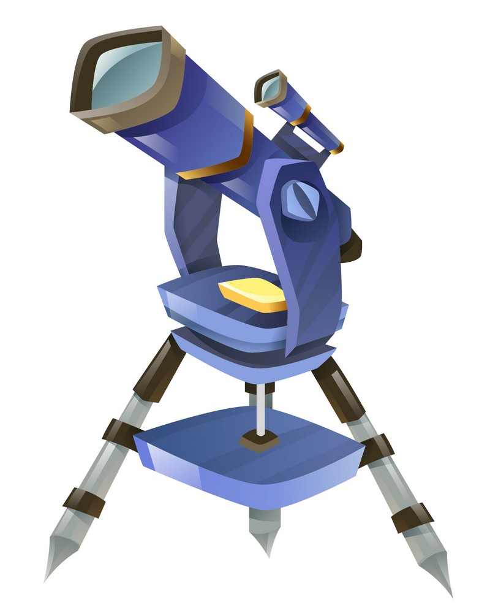
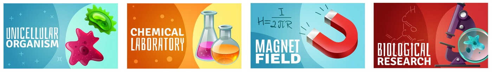
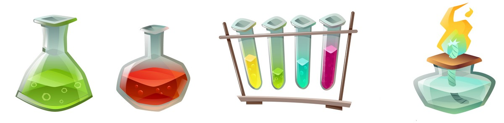

# Science labs

Scientific investigations in school using technology.

## Topic 1: Measurements and uncertainties
#### 1.1 Measurements in physics
#### 1.2 Uncertainties and errors
#### 1.3 Vectors and scalars

## Topic 2: Mechanics
#### 2.1 Motion
#### 2.2 Forces
#### 2.3 Work, energy and power
#### 2.4 Momentum and impulse

## Topic 3: Thermal physics
#### 3.1 Thermal concepts
#### 3.2 Modelling a gas

## Topic 4: Waves
#### 4.1 Oscillations

- 2019-10-25 [Period of a pendulum](frequency-pendulum) 35x5=175 data points
- 2018-12-03 [Period of a pendulum](frequency-pendulum)

#### 4.2 Travelling waves
#### 4.3 Wave characteristics
#### 4.4 Wave behaviour
#### 4.5 Standing waves

- 2019/11/26 [Speed of sound](speed-of-sound)

## Topic 5: Electricity and magnetism
#### 5.1 Electric fields
#### 5.2 Heating effects of electric currents
#### 5.3 Electric cells
#### 5.4 Magnetic effects of electric currents

## Topic 6: Circular motion and gravitation
#### 6.1 Circular motion
#### 6.2 Newton's law of gravitation

## Topic 7: Atomar, nuclear and particle physics
#### 7.1 Discrete energy and radioactivity
#### 7.2Nuclear reactions
#### 7.3 The structure of matter

## Topic 8: Energy production
#### 8.1 Energy sources
#### 8.2 Thermal energy transfer

- 2019/11/18 [Sun's surface temperature](sun-surface-temperature) With just a test tube and a thermometer.

## Topic 9: Wave phenomena
### 9.1 Simple harmonic motion
### 9.2 Single-slit diffraction
### 9.3 Interference
### 9.4 Resolution
### 9.5 Doppler effect

## Topic 10: Fields
### 10.1 Describing fields
### 10.2 Fields at work

## Topic 11: Electromagnetic induction
### 11.1 Electromagnetic induction
### 11.2 Power generation and transmission
### 11.3 Capacitance

## Topic 12: Quantum and nuclear physics
### 12.1 The interaction of matter with radiation
### 12.2 Nuclear physics

## Option D: Astrophysics
#### D.1 Stellar quantities
#### D.2 Stellar characteristics and stellar evolution
#### D.3 Cosmology
#### D.4 Stellar processes
#### D.5 Further cosmology

# Science MYP
## Unit 1: Cells, DNA and Inheritance
## Unit 2: Stoichiometry and the Periodic Table
## Unit 3: Newton's laws - Force and Motion

- 2019/11/29 [Build a trebuchet](https://sites.google.com/view/trebu) Students of grade 9 built their own catapult or trebuchet from cardboard to understand the concepts of a lever, velocity, acceleration, potential energy, kinetic energy, efficiency and momentum.

## Unit 4: Energy
## Unit 5: Carbon Chemistry and Chemical Reactions I
## Unit 6: Matter and Energy in Ecosystems
## Unit 7: Waves and Electromagnetic Radiation

# Sciencefair

- https://stemfair.org General information
- https://sites.google.com/ais.edu.vn/sciencefair Sciencefair at AISVN

## Sciencefair 2020

- https://sites.google.com/ais.edu.vn/sciencefair2020

## Sciencefair 2019

- [aisvn/sciencefair2019]()

## Sciencefair 2018
Off you go!
investigation

## Sciencefair 2017

- 2107-04-04 [Sciencefair 2017 at AIS](https://sites.google.com/ais.edu.vn/sciencefair2017) This was the second Science Fair, but without the high school participating

# Chemistry

## Measurements and uncertainties

- 2018-10-10 Five classes of grade 10 measured a lot of data.

## Equilibrium and neutralization

- Titration from early 2019 will follow. around equilibrium point some 15 minutes!

# Investigations, sometimes related to IAs and EEs

## Math

- 2019-06-08 [Battle Royale in Matlab](battle-royale) A simulation of several 'battle royale' contestants, calculated in Matlab using the ODE (Ordinary Differetial Equations) solver. The student later explored diffusion as the second derivative to model the behaviour.
- 2019-12-12 [Bifurcation in Mathematica](bifurcation) Having played with the chaotic behaviour of these functions in the early 90s of the last century on my Atari ST it was great to see them simulated in Mathematica. So I tried this on the free Mathematica 12.0 on my new Raspberry Pi 4.

## Physics

- 2018-10-10 Resonance frequency and related impedance of loudspeakers
- 2018-10-10 Force over travel for a keyboard, like the butterfly mechanism on MacBooks.

## Chemistry

- 2019-09-09 Concentration of vitamin C in oranges, apples and pears.

<a href="https://www.freepik.com/free-photos-vectors/design">Design vector created by macrovector - www.freepik.com</a>
