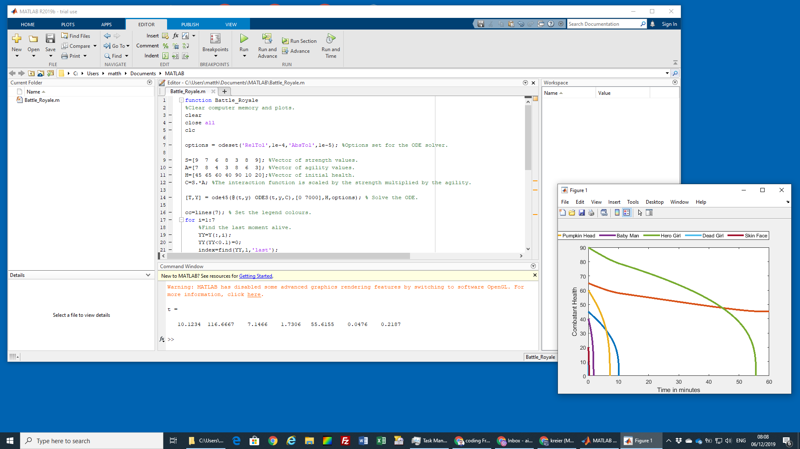
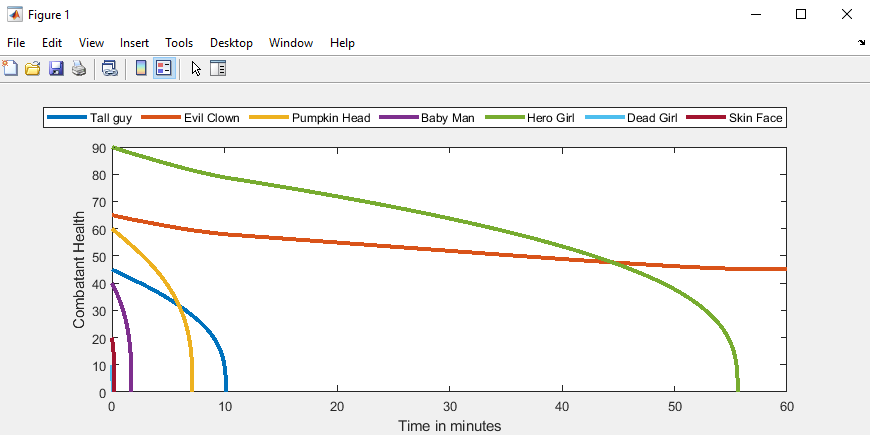

# Battle royale

This code was sent to me by a student for further investigation. I just copied it into my trial Matlab installation and it worked out of the box:



You can see in the graph how the characters do over time. With the set parameters, the 'evil clown' wins:



It uses ODE - the [Ordinary Differential Equation](https://www.mathworks.com/help/matlab/ordinary-differential-equations.html) solver from Matlab. And that's the whole code:

```
function Battle_Royale
%Clear computer memory and plots.
clear
close all
clc

options = odeset('RelTol',1e-4,'AbsTol',1e-5); %Options set for the ODE solver.

S=[9  7  6  8  3  8  9]; %Vector of strength values.
A=[7  8  4  3  8  6  3]; %Vector of agility values.
H=[45 65 60 40 90 10 20];%Vector of initial health.
C=S.*A; %The interaction function is scaled by the strength multiplied by the agility.

[T,Y] = ode45(@(t,y) ODES(t,y,C),[0 7000],H,options); % Solve the ODE.

cc=lines(7); % Set the legend colours.
for i=1:7
    %Find the last moment alive.
    YY=Y(:,i);
    YY(YY<0.1)=0;
    index=find(YY,1,'last');
    YY(YY==0)=nan;
    YY(index)=0;

    plot(T/60,YY,'linewidth',3,'color',cc(i,:)); %Plot results.
    t(i)=T(index)/60;
    hold on
end
t %Print out the times of death.
axis([0 60 0 90]) %Set axes.

%Make the plot look nice.
legend('Tall guy','Evil Clown','Pumpkin Head','Baby Man','Hero Girl','Dead Girl','Skin Face','location','northoutside','orientation','horizontal')
xlabel('Time in minutes')
ylabel('Combatant Health')

function dy = ODES(t,y,C)
Terms=y.*C'; %The value of the each combatant's attack.
dy=zeros(7,1); %Preallocation of the variables.
for i=1:7
    indices=[1:i-1,i+1:7]; %Indices to be summed over.
    dy(i)=-heaviside(y(i))/((1+y(i)^2)*2*C(i))*sum(Terms(indices));
%Differential equation.
end
```

I wonder if one could make this work in python ...
