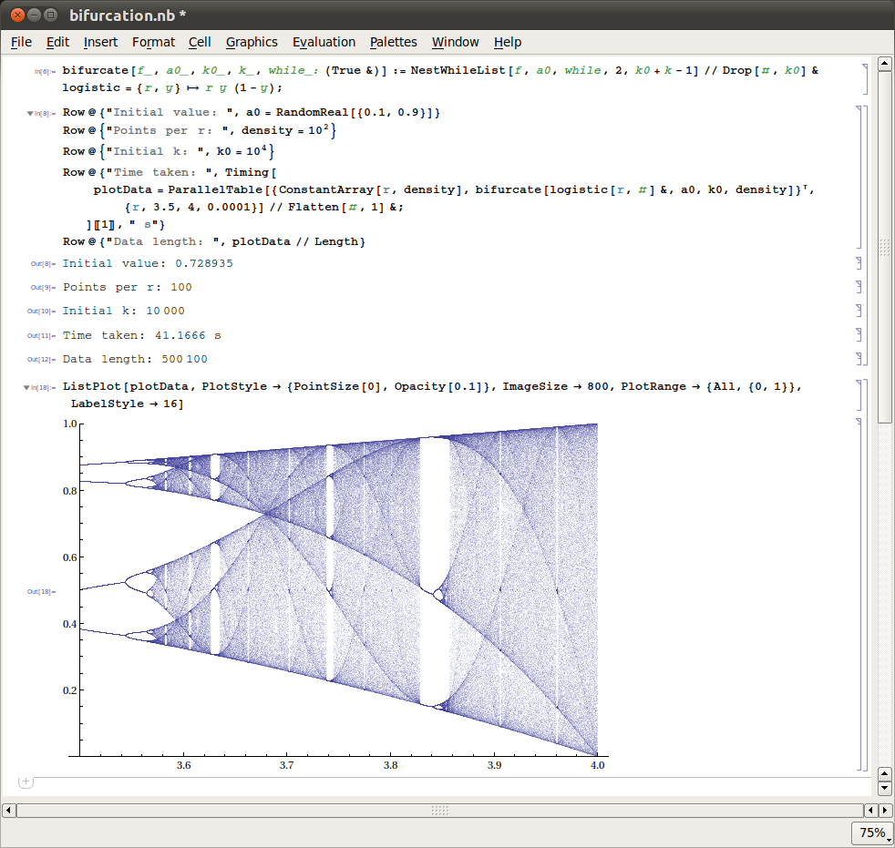
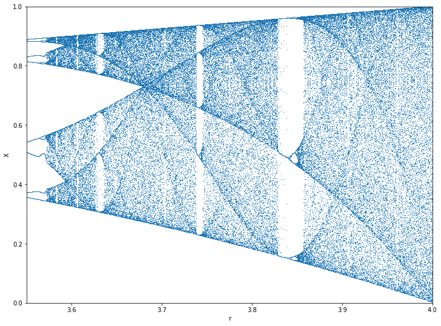

# Bifurcations

While trying Mathematica on the Raspberry Pi 4 I noticed the performance improvements. Since a calculation of a bifurcation was the screenshot for the wikipedia page I tried to replicate the output. I was looking for this:



But the 40 seconds didn't compute for my little ARM CPU. I tried Anaconda as well These are the results by language:

## Mathematica

I tried to copy this code, but the CPU run hot to 85 °C on all 4 cores. And several minutes later it produced error messages, but no graph. Like this 

*(kernel 2)* __Set::write:__ `Tag Times in (logistic (Drop[#1,10000]&))[{0.6586014743446188, logistic[3.5228,0.6586014743446188], logistic[3.5228,logistic[3.5228,0.6586014743446188]], <<46>>, logistic[3.5228,logistic[3.5228,logistic[3.5228, logistic[3.5228,logistic[3.5228,logistic[<<2>>]]]]]],<<10050>>}] is Protected.`

That's the code. We went to `Initial k: 10000`

``` mathematica
bifurcate[f_, a0_, k0_, k_, while_: (True &)] := 
  NestWhileList[f, a0, while, 2, k0 + k - 1] // 
    Drop[#, k0] & logistic = {r, y} -> ry (1 - y);

Row@{"Inital value: ", a0 = RandomReal[{0.1, 0.9}]}
Row@{"Points per r: ", density = 10^2}
Row@{"Inital k: ", k0 = 10^4}
Row@{"Time taken: ", 
  Timing[plotdata = 
      ParallelTable[{ConstantArray[r, density], 
          bifurcate[logistic[r, #] &, a0, k0, density]}^T, {r, 3.5, 
         4, 0.0001}] // Flatten[#, 1] &; ][[1]], " s"}
Row@{"Data length: ", plotData // Length}
ListPlot[plotData, PlotStyle -> {Pointsize[0], Opacity[0.1]}, 
 ImageSize -> 800, PlotRange -> {All, {0, 1}}; LabelStyle -> 16]
```


## Jupyter notebook

``` py
import numpy as np
import matplotlib.pyplot as plt
plt.figure(figsize=(12, 9))

# Logistic function implementation
def logistic_eq(r,x):
    return r*x*(1-x)

# Create the bifurcation diagram
def bifurcation_diagram(seed, n_skip, n_iter, step=0.0001, r_min=0):
    print("Starting with x0 seed {0}, skip plotting first {1} iterations, then plot next {2} iterations.".format(seed, n_skip, n_iter));
    # Array of r values, the x axis of the bifurcation plot
    R = []
    # Array of x_t values, the y axis of the bifurcation plot
    X = []
    
    # Create the r values to loop. For each r value we will plot n_iter points
    r_range = np.linspace(r_min, 4, int(1/step))

    for r in r_range:
        x = seed;
        # For each r, iterate the logistic function and collect datapoint if n_skip iterations have occurred
        for i in range(n_iter+n_skip+1):
            if i >= n_skip:
                R.append(r)
                X.append(x)
                
            x = logistic_eq(r,x);
    # Plot the data    
    plt.plot(R, X, ls='', marker=',')
    plt.ylim(0, 1)
    plt.xlim(r_min, 4)
    plt.xlabel('r')
    plt.ylabel('X')
    plt.show()

bifurcation_diagram(0.2, 100, 10, r_min=3.55)
```

