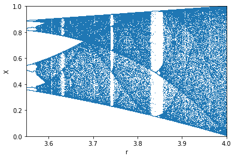

# Bifurcations

While trying Mathematica on the Raspberry Pi 4 I noticed the performance improvements. Since a calculation of a bifurcation was the screenshot for the wikipedia page I tried to replicate the output. I was looking for this:

But the 40 seconds didn't compute for my little ARM CPU. I tried Anaconda as well These are the results by language:

## Mathematica

## Jupyter notebook

