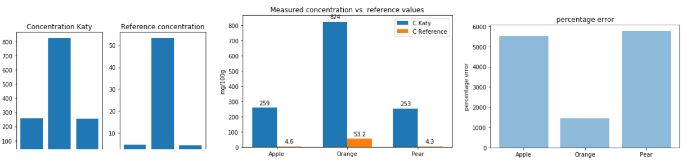
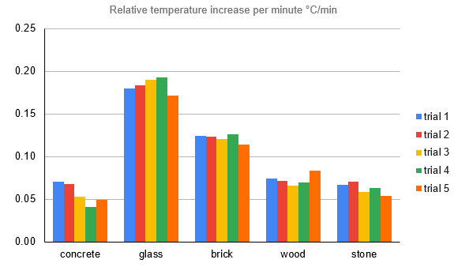

# EE - Extended Essay

Just a small collection of notebooks related to recent EEs. Some validation of data.

## Determination of Ascorbic Acid (Vitamin C) in different fruits

The antioxidizing properties of Vitamin C are well known. The project is a good oportunity for the student to learn about the history, the effect and the practice in a science laboratory to determine reliable data.

In this specific case the student determined values that were too high. Let's start with some sample concentration various fruits. What results should we expect? Looking at labels of juice in the supermarket we can see values like 10 mg/100ml for apple juice, mixed pinapple juice has 30 mg/200ml and orange juice 20 mg/100ml. Further concentrations are well known and pulished multiple times, for example by USDA ([link](https://fdc.nal.usda.gov/)). 

| Fruit                             | Apple | Orange | Pear |
|-----------------------------------|:-----:|:------:|:----:|
| Concentration Katy (g/cm³)        |  2.59 |  8.24  | 2.53 |
| Converted concentration (mg/100g) |  259  |   824  |  253 |
| Reference concentration (mg/100g) |  4.6  |  53.2  |  4.3 |

The Jupyter notebook [Katy_EE.ipynb](Katy_EE.ipynb) contains the findings from November 2019. Visualization looks like this:

## Determination of phosphate in different soils

Here we need a molybdate complex and a spectrometer to measure the absorbance.

The results:

## Effect of glass fascade on building temperature and energy costs

It's a great idea from Derrick to investigate the challenges of glass fascades in sunny countries like Vietnam. How much energy is needed for A/C on a building like [Landmark 81](https://en.wikipedia.org/wiki/Landmark_81)? Can you save 723 tons of CO2 per day with different materials? He conducted his own experiment and got some interesting results:

The data is consistent!
