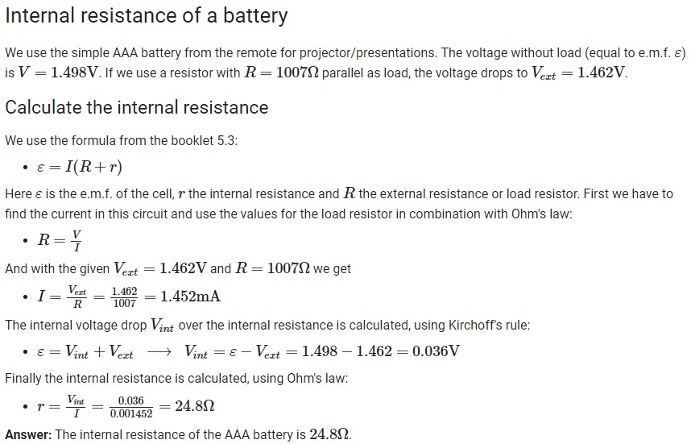
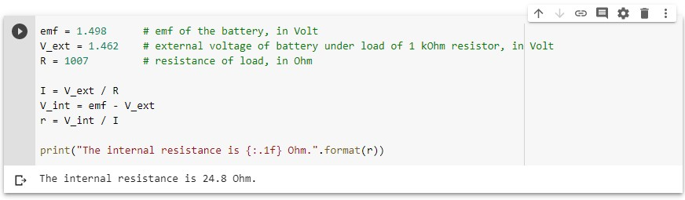

# Internal resistance of a battery

> 2020/05/05

This is part of our Jupyter notebook:

And this is the setup:

We took the AAA battery of a remote and measured the voltage without load and with a 1 kOhm resistor (1007 Ohm). Results:

- epsilon = 1.498 V
- V_ext = 1.462 V

Using the formula epsilon = I ( R + r ) we got:

Internal resistance r = 24.8 Ohm.

Look at the Jupyter notebook: [internal_resistance_battery_updated.ipynb](internal_resistance_battery_updated.ipynb).
