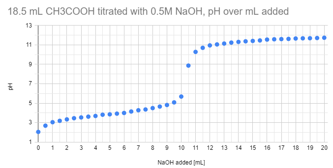

# Titration

That's a pretty standard procedure in highschool chemistry. You can do it with easy combinations of strong acids and bases like HCL and NaOH. The equilibrium point might take some time, though, as this experiment shows, recored with Vernier LoggerLite and the beaker on a electrical stirrer.

> THIS IMAGE IS MISSING! But it took 15 minutes!

Its also quite doable just with a 3 mL pipette, 100 mL beaker, a dilluted weak acid like acetic acid (vinegar) and NaOH solution. We did this experiment at home in December 2020:

Can you determine the concentration of acetic acid? Can you convert it to the percentage concentration (volume percentage) as well?

